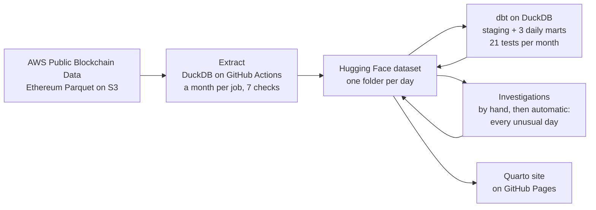

# twinfault

**Is it the business, or the pipeline?** When a payments metric suddenly moves, the first question is whether customers changed or the data did. twinfault answers it on real data: every USDT, USDC and PYUSD transfer on Ethereum from January 2024 to September 2026.

**[Live site](https://andreas142.github.io/twinfault/)** · **[Every unusual day](https://andreas142.github.io/twinfault/watch)** · **[Investigations](https://andreas142.github.io/twinfault/investigations)** · **[Dataset on Hugging Face](https://huggingface.co/datasets/andrew142/stablecoin-payments-eth)** · **[dbt docs](https://andreas142.github.io/twinfault/dbt/)**

| 733M | 7.18M | 1,004 | 21 | €0 |
|:---:|:---:|:---:|:---:|:---:|
| stablecoin transfers, reconciled day by day | Ethereum blocks, none missing or duplicated | days, Jan 2024 to Sep 2026 | dbt tests passed by every month | a month to run |

## What the data showed

Four real anomalies, each checked against the pipeline first, then explained with evidence from the raw rows. Full write-up with charts: **[Investigations](https://andreas142.github.io/twinfault/investigations)**.

| Anomaly | Verdict | The evidence |
|---|---|---|
| USDC and USDT failure rates jump to 19.5% and 17.7% (Nov 2025; usually under 1%) | **Real behaviour:** a wave of new automated senders | No duplicates or missing blocks. 48% of calls came from addresses never seen on ordinary days. On the worst day 55,271 USDT calls from 54,740 addresses all used exactly 50,000 gas; without them USDT's failure rate is 0.71%, not 17.71%. It coincided with Ethereum raising its gas limit and fees falling to 0.055 gwei. |
| PYUSD failing up to 61% of the time (Aug–Sep 2024) | **Bots, not users** | Regular senders failed 0.16% at most. 99.9% of failed calls came from new addresses, 99.8% used exactly 64,474 gas, and 64 addresses failed on almost every call. |
| 600 trillion PYUSD moved in one day (15 Oct 2025) | **A real event**, not a units bug | Paxos minted 300T PYUSD and burned it 22 minutes later. The same address burned 300M earlier that day and minted 300M later that day: 300T is exactly 10⁶ × 300M, and PYUSD has 6 decimals. Consistent with the right amount entered in the wrong units. |
| 61 of 1,004 days have rows written long after the day | **Pipeline:** the source rewrote past data | 44 whole days delivered late (worst: 397 days), 17 days patched afterwards, always in all three tables together. Any number on those days may differ from what a dashboard first showed. |

The method is the same every time: **rule out the pipeline, break the metric down until one group explains the move, remove that group and show the metric returns to normal, then corroborate.** One check went wrong on the way and is kept on the page: transfer addresses are stored as 32-byte words, so the first search for mints silently matched nothing.

## Every unusual day, found and checked automatically

The four cases above were worked out by hand. `scripts/watch.py` does the same work on its own, across the whole dataset, without being told a date. Full results: **[Every unusual day](https://andreas142.github.io/twinfault/watch)**.

1. **Find:** score every token and day for transfers, value moved and failure rate against the same weekday over the previous eight weeks, and group unusual days into episodes. It finds 133.
2. **Check the pipeline first** on the raw rows of the 40 most severe: missing or repeated blocks, an incomplete day, repeated rows, a mart that disagrees with its raw rows, amounts that changed units, days the source rewrote.
3. **Then explain the move:** one program (an exact gas fingerprint), new addresses, a few addresses, dust, the issuer minting or burning, a few huge transfers. It compares against ordinary days before the whole wave, so an earlier wave never counts as "usual". If no group explains the move, it says so instead of inventing a reason.
4. **Score itself:** it is checked afterwards against the four hand investigations, which it never sees while deciding. **It matches all four**, and it flags the same 61 rewritten days.

Things it found that were not investigated by hand: USDT dust waves after the Fusaka upgrade (December 2025 to January 2026, up to 3× the usual transfers, mostly under 1 token) and the day they ended (late April 2026, when daily USDT transfers halved); a 368B USDC day (22 March 2026) where ten addresses sent most of the extra value; and several more failure waves from single programs, each with its own exact gas value.

## The look-alike pairs

Every metric move has two possible explanations that look the same on a dashboard: a pipeline fault, or a real change in behaviour. The metric alone cannot separate them; the rows can. Most of these checks run automatically on every unusual day.

| Pipeline fault | Business twin | Same headline effect | Evidence that separates them |
|---|---|---|---|
| A day's partition not loaded | Real network slowdown | Volume drops | Gaps in block numbers vs continuous blocks with fewer transfers |
| Same data loaded twice | Genuine surge | Volume jumps | Repeated transaction hashes vs unique ones |
| Late-arriving data | Real slowdown that day | Yesterday looks low | Load time lags block time, then backfills |
| Decimals bug, values off by a power of 10 | Real surge in large transfers | Average value jumps | Exact 10× factor vs a shifted distribution |
| Classification rule changed | Real mix shift | Segment shares move | Rule version changed while raw data did not |
| Timezone bug | Real change in hourly pattern | Hourly profile shifts | Constant whole-hour offset |
| Filter drops failed transactions | Real fall in failures | Failure rate falls | Raw and modelled counts disagree |

The PYUSD mint above is a real decimals twin: on a dashboard it looks exactly like a units bug, and it wasn't one. The automatic checks tell them apart the same way: a units bug moves every percentile of the amounts by exactly a power of ten, while a mint shows up as transfers from the zero address.

## How it is built



- **Extract** (`scripts/extract_month.py`): DuckDB reads the AWS public Parquet files straight from S3 on free GitHub runners, filters to the three tokens, keeps failed calls to the token contracts, and writes a load log. A month is uploaded only if it passes seven checks: every day present, no duplicate transfers, no missing amounts or addresses, every transfer's transaction and block present, no block gaps, no duplicate blocks.
- **Model** (`analytics/`): dbt on DuckDB builds staging models and three daily marts per month: payments by token, amount band and route; token health (direct calls, failures, fees); and pipeline health (block gaps, duplicates, load delay). A month is published only if every test passes, including a reconciliation that the daily cube adds up to the raw transfers exactly.
- **Investigate** (`scripts/investigate.py`): downloads only the days involved and runs the checks behind the Investigations page. Every result table is published under `investigations/` in the dataset.
- **Watch** (`scripts/watch.py`, `twinfault/`): finds every unusual day in the marts, checks the most severe on the raw rows, and records a verdict with its evidence. The rules are plain Python in `twinfault/verdicts.py`, so every verdict can be traced to the check that produced it. Results are published under `watch/`.
- **Publish** (`site/`): Quarto rebuilds the site from the marts and the investigation tables, and GitHub Pages hosts it. Every number on the site is computed from the published data at build time.

There is no server, no database to host and no subscription. Every step is a GitHub Actions workflow you can run from the Actions tab.

| Workflow | What it does |
|---|---|
| Phase 1 - probe AWS data | Reads a day or month of the AWS source and reports its shape and quirks |
| Phase 1 - extract one month | Extracts and checks one month without uploading |
| Phase 2 - backfill to Hugging Face | Extracts, checks and uploads a range of months, four at a time |
| Phase 3 - build the analytics cube | Runs dbt and its tests on each month and uploads the marts |
| Phase 3b - publish the website | Builds the dbt docs and the Quarto site and deploys them to GitHub Pages |
| Phase 3c - investigate the unusual days | Runs the investigations and uploads their result tables |
| Phase 4 - investigate every unusual day | Finds and checks every unusual day automatically and uploads the verdicts |

## Repository layout

```
.github/workflows/   the seven workflows above
twinfault/           episode detection, checks on the raw rows, and the verdict rules
scripts/             extract, backfill helpers, AWS probe, investigations, watch
analytics/           dbt project: staging models, marts, tests, docs overview
site/                Quarto website: one .qmd per page, shared helpers in twinfault_site.py
```

## Use the data

DuckDB reads the dataset straight from Hugging Face, with no download:

```sql
SELECT date_trunc('month', date) AS month, token, count(*) AS transfers, sum(amount) AS volume
FROM 'hf://datasets/andrew142/stablecoin-payments-eth/stablecoin_transfers/*/*.parquet'
WHERE date >= DATE '2026-01-01'
GROUP BY ALL ORDER BY ALL;
```

The [dataset card](https://huggingface.co/datasets/andrew142/stablecoin-payments-eth) documents every table and column, the checks, and the known limitations.

## Status

- [x] Extract and check 33 months of transfers, transactions and blocks
- [x] dbt models, daily marts, tests and freshness checks
- [x] Website and dbt documentation
- [x] Four real anomalies investigated: pipeline or business, with evidence
- [x] Every unusual day found and checked automatically, and scored against the hand investigations
- [ ] Run the checks automatically after each new month is loaded
- [ ] Keep a snapshot of every load, so a rewritten day can be compared with what was first published

## Data and licence

Source: [AWS Public Blockchain Data](https://registry.opendata.aws/aws-public-blockchain/) (MIT-0). The derived dataset is released under MIT; the code in this repository under Apache 2.0.

Built by [Andreas Othonos](https://github.com/Andreas142).
